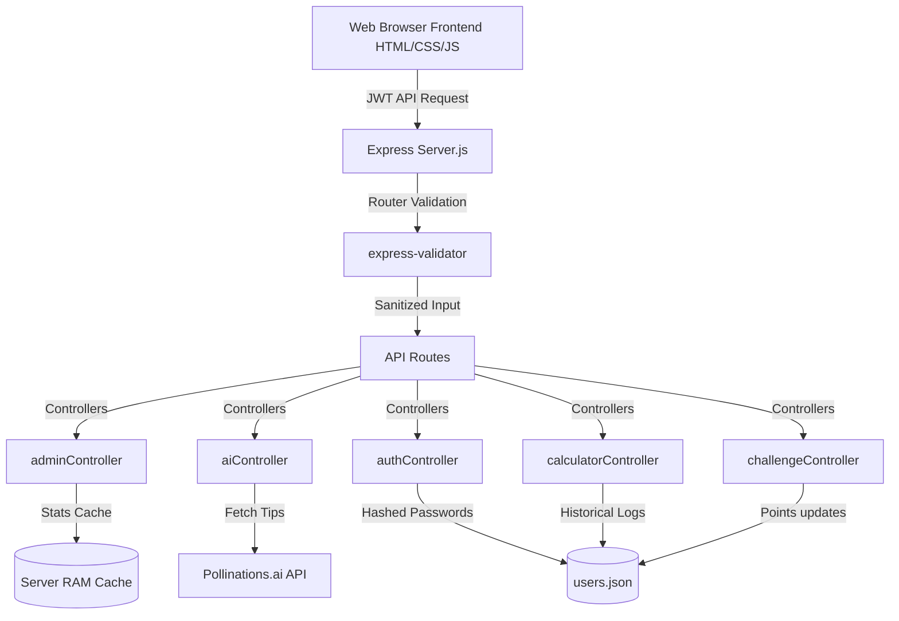

# EcoTrack – Carbon Footprint Awareness Platform

EcoTrack is a modern, professional, hackathon-ready full-stack web application designed to help users calculate, track, and reduce their daily carbon footprint. 

---

## 1. Problem Statement
Global greenhouse gas emissions continue to rise, accelerating climate change and its severe environmental consequences. Individual daily actions—from commuting habits to household energy consumption—collectively account for a massive share of these emissions. However, most individuals remain unaware of their personal carbon output due to:
- A lack of accessible, user-friendly calculation tools.
- A lack of clear, relatable context (e.g. what is 10 kg of CO₂ equivalent to?).
- A lack of immediate, actionable recommendations to reduce emissions.
- A lack of community engagement or gamified motivation to build long-term sustainable habits.

---

## 2. Chosen Vertical
**Environmental Sustainability & Climate Action**
- **UN SDG 13: Climate Action:** Empowers individuals to measure and reduce emissions through actionable daily logs.
- **UN SDG 11: Sustainable Cities & Communities:** Encourages micro-level community changes (public transit, waste reduction, energy efficiency) that lower municipal carbon footprints.

---

## 3. Approach and Logic
EcoTrack approach focuses on **behavioral transformation through calculation, visualization, gamification, and AI education**:
- **Calculation Logic:** Converts raw usage data into carbon dioxide equivalent (CO₂e) kilograms using industry-standard conversion factors:
  - Transportation: $0.21$ kg CO₂e per km.
  - Electricity: $0.82$ kg CO₂e per kWh.
  - Water: $0.0015$ kg CO₂e per Liter.
  - Gas: $1.5$ kg CO₂e per cubic meter.
  - Waste: $0.5$ kg CO₂e per kg.
- **Comparison Logic:** Compares total daily emissions against the global daily average ($4,000\text{ kg CO}_2\text{/year} \approx 10.96\text{ kg CO}_2\text{/day}$) to give users context. It also calculates a **Tree Equivalent** indicating how many trees are required to absorb that amount (assuming $1\text{ tree} = 21\text{ kg CO}_2\text{/year}$ absorption rate).
- **Gamification Logic:** Awards scores for logging calculations (with extra points given for keeping daily emissions below sustainability thresholds) and completing challenges.
- **Education Logic:** Integrates a zero-setup, open-source AI sustainability assistant that dynamically provides custom tips based on the user's latest logs.

---

## 4. How the Solution Works
1. **User Sign Up & Log In:** Secure JWT-based authentication allows users to establish profiles.
2. **Emissions Calculator:** Users log daily inputs (kms driven, water used, etc.). The backend computes the raw CO₂e footprint and outputs instant metrics.
3. **Interactive Dashboard:** Chart.js displays a breakdown doughnut chart of the latest log and a historical line graph showing emissions trends.
4. **PDF Reports:** HTML2PDF allows users to instantly compile and print a professional progress report.
5. **AI Assistant:** Users can ask the bot sustainability questions or fetch customized recommendations based on their latest calculator entry.
6. **Eco Challenges:** Users enroll in daily/weekly tasks (e.g., composting, biking) and check them off to gain points.
7. **Leaderboard:** Compares and ranks all users by their scores to drive friendly competition.
8. **Admin Portal:** Allows administrators to view overall platform statistics and dynamically issue new challenges.

---

## 5. Features
- **Dynamic Calculator:** Non-negative validation on inputs.
- **Aesthetic Glassmorphism UI:** Seamless, modern, responsive CSS design.
- **Data Caching:** High-speed Redis-like caching on statistics and leaderboard rankings to reduce file reads.
- **Bulletproof Input Sanitization:** Recursive XSS payload stripping and strict `express-validator` schemas.
- **Zero-Setup AI Assistant:** Freeform query support powered by Pollinations.ai API.
- **Gamified Rewards:** Points accumulation and interactive leaderboards.

---

## 6. Architecture
EcoTrack follows a clean MVC-inspired REST API architecture:



---

## 7. Assumptions
- Everyday activity parameters represent a reliable, standardized approximation of household emissions.
- Offline local JSON files serve as a robust, lightweight database structure suitable for simple hackathon deployments and offline-ready setups.
- Standard EPA/IEA emission factors match average urban household consumption properties.

---

## 8. Tech Stack
- **Frontend:** HTML5, Vanilla CSS3 (Glassmorphism layout, Outfit Google Font), JavaScript (ES6+), FontAwesome Icons.
- **Backend:** Node.js, Express.js.
- **Testing:** Jest, Supertest.
- **AI Integration:** Pollinations.ai Text API (Free, zero-setup, open-source LLM proxy).
- **Libraries:** `cors`, `helmet`, `hpp`, `compression`, `express-rate-limit`, `express-validator`, `jsonwebtoken`, `bcryptjs`, `uuid`.

---

## 9. Installation Guide

### Prerequisites
- [Node.js](https://nodejs.org/) (v16+ recommended)

### Backend Configuration
1. Clone or download the repository.
2. In the root directory, create a `.env` file from the example template:
   ```bash
   cp .env.example .env
   ```
3. Set your local parameters in `.env`:
   ```env
   PORT=3000
   JWT_SECRET=your_super_secret_jwt_key_here
   ```
4. Install dependencies:
   ```bash
   npm install
   ```
5. Start the Express server:
   ```bash
   npm start
   ```
   The backend will start running at `http://localhost:3000`.

### Running Tests
Verify the health and test coverage of the platform:
```bash
npm test
```

---

## 10. Screenshots Section
The platform incorporates responsive design interfaces:

### Interactive User Dashboard
The dashboard provides a visual breakdown of carbon outputs and trees equivalent comparison.

### AI Assistant Chat
Chat with the Sustainability Assistant to request actionable tips to reduce highest emission sectors.

---

## 11. Future Enhancements
- **Smart Meter Integrations:** Retrieve automatic electrical, water, and gas readings via smart home APIs.
- **Team Challenges:** Enable group challenges where workspaces or classrooms can log carbon savings together.
- **Municipal Portal:** Aggregated, anonymous footprint statistics allowing local city planners to analyze transit and recycling trends.
